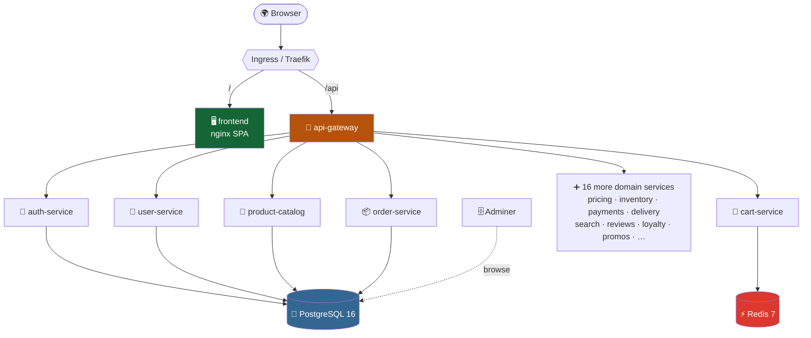

<div align="center">

```text
      ██████╗██████╗ ██╗   ██╗███╗   ███╗██████╗        ██╗
     ██╔════╝██╔══██╗██║   ██║████╗ ████║██╔══██╗       ██║
     ██║     ██████╔╝██║   ██║██╔████╔██║██████╔╝    ████████╗
     ██║     ██╔══██╗██║   ██║██║╚██╔╝██║██╔══██╗    ██╔═██╔═╝
     ╚██████╗██║  ██║╚██████╔╝██║ ╚═╝ ██║██████╔╝    ██████║
      ╚═════╝╚═╝  ╚═╝ ╚═════╝ ╚═╝     ╚═╝╚═════╝     ╚═════╝
     ███████╗███╗   ███╗██████╗ ███████╗██████╗
     ██╔════╝████╗ ████║██╔══██╗██╔════╝██╔══██╗
     █████╗  ██╔████╔██║██████╔╝█████╗  ██████╔╝
     ██╔══╝  ██║╚██╔╝██║██╔══██╗██╔══╝  ██╔══██╗
     ███████╗██║ ╚═╝ ██║██████╔╝███████╗██║  ██║
     ╚══════╝╚═╝     ╚═╝╚═════╝ ╚══════╝╚═╝  ╚═╝
```

### 🥐 Crumb & Ember — Cloud-Native Bakery Platform 🥖

**25 containers · 21 domain microservices · PostgreSQL · Redis · Kubernetes · 100% JSON logs**


*A production-grade e-commerce platform for an artisan bakery — built the way real platforms are built.*

[⚡ Quick Start](#-quick-start-one-command) · [🏗 Architecture](#-architecture) · [🗄 Data Layer](#-data-layer) · [📜 JSON Logging](#-json-logging) · [☸️ Kubernetes](#️-deploying-to-kubernetes) · [🔐 Production Checklist](#-production-checklist)

</div>

---

## 🧊 The Stack, In 3D

```text
                          ╔════════════════════════════════╗
                       ╔══╣        🌍  I N G R E S S       ║══╗
                       ║  ╚════════════════════════════════╝  ║
                  /  path                                 /api path
                       ▼                                      ▼
        ┌────────────────────────┐          ┌────────────────────────┐
       ╱   🖥  FRONTEND (nginx) ╱│         ╱   🚪 API GATEWAY       ╱│
      ┌────────────────────────┐ │        ┌────────────────────────┐ │
      │  SPA · JSON access log │╱         │ routing · x-request-id │╱
      └────────────────────────┘          └───────────┬────────────┘
                                                      │
      ┌───────────────────────────────────────────────┼─────────────────┐
      ▼                       ▼                       ▼                 ▼
   ┌──────────┐         ┌──────────┐            ┌──────────┐      ┌──────────┐
  ╱ 🔐 auth  ╱│        ╱ 🛒 cart  ╱│           ╱ 📦 order ╱│     ╱ 🍞 …18   ╱│
 ┌──────────┐ │       ┌──────────┐ │          ┌──────────┐ │    ┌──────────┐ │
 │ scrypt + │╱        │ Redis    │╱           │ Postgres │╱     │ services │╱
 │ tokens   │         │ TTL 7d   │            │ ledger   │      │          │
 └────┬─────┘         └────┬─────┘            └────┬─────┘      └──────────┘
      │                    │                       │
      ▼                    ▼                       ▼
 ╔════════════════╗  ╔═══════════╗      ╔══════════════════════════╗
 ║ 🐘 POSTGRES 16 ║  ║ ⚡ REDIS 7 ║      ║ 🗄 ADMINER  (DB web UI)  ║
 ║  StatefulSet   ║  ║  LRU+AOF  ║      ║  browse every table live ║
 ╚════════════════╝  ╚═══════════╝      ╚══════════════════════════╝
```

---

## ⚡ Quick Start (one command)

> Perfect for a client demo — the entire platform, database included, on any machine with Docker.

```bash
docker compose up --build -d        # or: make up
```

| What | Where | Credentials |
|---|---|---|
| 🥐 **Bakery website** | http://localhost:8080 | — |
| 🚪 **API gateway** | http://localhost:3000/api/products | — |
| 🗄 **Adminer (DB frontend)** | http://localhost:8081 | server `postgres` · user `bakery` · pass `bakery` · db `bakery` |
| 🐘 **PostgreSQL** | localhost:5432 | `bakery` / `bakery` |
| 👤 **Demo login** | `amelie@crumbandember.dev` | `baguette` |

Then verify the whole flow end-to-end:

```bash
make smoke      # login → token verify → cart in Redis → order in Postgres ✅
make logs       # live JSON log firehose from all 25 containers
```

### 📖 API docs & platform status (served by the gateway)

| What | Compose | Kubernetes (Ingress) |
|---|---|---|
| **Swagger UI** (interactive, try-it-out) | http://localhost:3000/api/docs | http://bakery.local/api/docs |
| **OpenAPI 3 spec** (import into Postman/Insomnia) | http://localhost:3000/api/openapi.json | http://bakery.local/api/openapi.json |
| **API index** (route list) | http://localhost:3000/api | http://bakery.local/api |
| **Live upstream health** (all 21 services, one call) | http://localhost:3000/api/status | http://bakery.local/api/status |

The frontend footer also renders a live per-service status grid from `/api/status`,
so you can see at a glance which services the page is actually integrated with.

> **"Route not found" / frontend shows static fallback?** That means the gateway is
> reachable but its upstreams are not. Check: `kubectl -n bakery get pods` — pods in
> `ImagePullBackOff` mean the `ghcr.io/YOUR_GITHUB_USERNAME/...` image references in
> `k8s/services/*.yaml` were never replaced with your real registry, or images were
> never built and pushed. `GET /api/status` tells you exactly which services are down.

---

## 🏗 Architecture



<details>
<summary><b>📋 Full service catalogue (click to expand)</b></summary>

| Service | Responsibility | Storage |
|---|---|---|
| `frontend` | Bakery website (nginx, static SPA, JSON access logs) | — |
| `api-gateway` | Routes `/api/*`, propagates `x-request-id` | — |
| `auth-service` | Registration, login (scrypt hashes), HMAC-signed tokens | 🐘 PostgreSQL |
| `user-service` | Customer profiles & addresses | 🐘 PostgreSQL |
| `product-catalog-service` | Breads, viennoiserie, patisserie | 🐘 PostgreSQL |
| `order-service` | Order lifecycle & status ledger | 🐘 PostgreSQL |
| `cart-service` | Shopping baskets (7-day TTL) | ⚡ Redis |
| `inventory-service` | Per-product stock levels | in-memory |
| `pricing-service` | Prices, VAT, order quotes | in-memory |
| `payment-service` | Razorpay payments (order · verify · webhook; mock fallback) | postgres |
| `delivery-service` | Bike delivery / pickup scheduling | in-memory |
| `notification-service` | Email & SMS fan-out (mock) | in-memory |
| `review-service` | Product reviews | in-memory |
| `search-service` | Catalog search | in-memory |
| `recommendation-service` | Pairing suggestions | in-memory |
| `promotion-service` | Discount codes | in-memory |
| `loyalty-service` | "Crumbs" points program | in-memory |
| `recipe-service` | Internal bake specs | in-memory |
| `baking-schedule-service` | Today's oven schedule | in-memory |
| `supplier-service` | Mills / dairies, purchase orders | in-memory |
| `analytics-service` | Event ingestion + metrics | in-memory |
| `media-service` | Product imagery metadata | in-memory |
| `invoice-service` | Wholesale invoices | in-memory |

Services marked *in-memory* are stateless/mock by design and follow the same
storage-adapter pattern as the Postgres-backed ones — wiring another one to the
database is a ~30-line change.

</details>

Every Node service exposes `GET /health` (liveness) and `GET /ready` (readiness — **actively pings its database** when one is configured, so Kubernetes never routes traffic to a pod that lost its DB). The frontend exposes `GET /healthz`.

---

## 🗄 Data Layer

| Component | Role | Highlights |
|---|---|---|
| 🐘 **PostgreSQL 16** | System of record | StatefulSet + 5Gi PVC · schema & seed auto-applied on first boot · products, profiles, accounts, orders (JSONB items) |
| ⚡ **Redis 7** | Hot state | Carts with 7-day TTL · `allkeys-lru` eviction · AOF persistence |
| 🗄 **Adminer** | DB frontend | Browse/edit every table from the browser · dark "dracula" theme · zero config |

Services degrade gracefully: with no `DATABASE_URL` / `REDIS_URL` they fall back to in-memory storage — handy for running a single service in isolation.

```text
 login/register ──▶ accounts   (scrypt password hashes — never plaintext)
 profiles       ──▶ profiles   (dietary prefs as JSONB)
 catalogue      ──▶ products   (12 seeded artisan products)
 checkout       ──▶ orders     (ord-1001, ord-1002, … via a DB sequence)
 baskets        ──▶ redis      (cart:<userId>, expires after 7 days)
```

---

## 📜 JSON Logging

Every log line from **all 25 containers** is a single JSON object on stdout — ready for Fluent Bit, Loki, ELK, CloudWatch, or Datadog with zero parsing config.

- **Node services** use [pino](https://getpino.io): `service`, `level`, ISO `time`, an `event` name, and request context. The gateway mints an `x-request-id` and every downstream hop logs it → **one grep traces a request across the whole platform**.
- **frontend (nginx)** uses `log_format json_combined escape=json` with the same `service`/`level`/`time` keys.
- Authorization headers are **redacted** in auth-service logs.

```json
{"level":"info","time":"2026-07-09T08:12:31.402Z","service":"order-service","version":"1.0.0","event":"order_created","orderId":"ord-1001","userId":"u-1","itemCount":3,"requestId":"req_x8k2m1qa","msg":"order received"}
{"level":"info","time":"2026-07-09T08:12:31.455Z","service":"cart-service","version":"1.0.0","event":"cart_cleared","userId":"u-1","requestId":"req_x8k2m1qa","msg":"cart cleared"}
```

---

## ☸️ Deploying to Kubernetes

```bash
make k8s-deploy        # runs ./scripts/deploy.sh
# Sequential rollout with health checks:
#   1️⃣ namespace + secrets (k8s/secrets.yaml if present)
#   2️⃣ data layer — waits for postgres, redis, adminer to be Ready
#   3️⃣ all 23 services ONE AT A TIME, in dependency order —
#      each must pass `kubectl rollout status` before the next is applied;
#      a failing service stops the deploy and prints pod diagnostics
#   4️⃣ HPA + PodDisruptionBudgets
#   5️⃣ Traefik ingress (bakery.local + db.bakery.local)

make k8s-deploy-fast   # old behaviour: apply everything at once, no checks
```

**Ingress is Traefik** (`ingressClassName: traefik` + a `Middleware` CRD capping request bodies at 5 MiB). Install it once per cluster:

```bash
helm repo add traefik https://traefik.github.io/charts
helm install traefik traefik/traefik -n traefik --create-namespace
```

**Image names update themselves.** On every push to `main`, `.github/workflows/build-images.yml` builds and pushes all images to GHCR, then a follow-up job rewrites the `image:` line in every `k8s/services/*.yaml` to `ghcr.io/<owner>/<repo>/<service>:<short-sha>` and commits it back (`[skip ci]`). No more editing `YOUR_GITHUB_USERNAME` by hand — the manifests in git always point at the exact images built from that commit. Deploying to the cluster stays a manual step: run `make k8s-deploy` after CI updates the manifests.

**Razorpay payments.** `payment-service` integrates Razorpay (order creation, checkout signature verification, and a webhook at `/api/payments/razorpay/webhook`). Copy `k8s/secrets.example.yaml` to `k8s/secrets.yaml`, fill in your key ID / key secret / webhook secret from the Razorpay dashboard, and `deploy.sh` applies it. Without the secret the service boots in mock mode, so local dev and CI need no credentials. For docker compose, set `RAZORPAY_KEY_ID` / `RAZORPAY_KEY_SECRET` / `RAZORPAY_WEBHOOK_SECRET` in `.env`.

**Hardening already applied to every pod:**

```yaml
runAsNonRoot: true                 seccompProfile: RuntimeDefault
readOnlyRootFilesystem: true       capabilities: { drop: ["ALL"] }
allowPrivilegeEscalation: false    resources: requests + limits everywhere
```

Plus: readiness probes that check the actual database connection, HPA on the gateway and frontend (2→6 / 2→4 replicas at 70% CPU), PodDisruptionBudgets on the edge, and all credentials injected from a single `bakery-db-secret`.

---

## 🧰 Command Cheat-Sheet

| Command | Does |
|---|---|
| `make up` / `make down` | Start / stop the full local stack |
| `make logs` | Tail JSON logs from every container |
| `make smoke` | End-to-end test: auth → cart → order |
| `make k8s-deploy` | Deploy everything to Kubernetes in the right order |
| `make k8s-status` | Pods, services, ingress, HPAs at a glance |

---

## 🔐 Production Checklist

Before going live for real:

- [ ] Rotate every secret in `k8s/data/postgres.yaml` (or manage `bakery-db-secret` via Sealed Secrets / External Secrets / SOPS) and set a strong `AUTH_TOKEN_SECRET`
- [ ] Put TLS on the ingress (cert-manager + Let's Encrypt) and real DNS instead of `bakery.local`
- [ ] Protect or remove the `db.bakery.local` Adminer rule (basic-auth annotation, oauth2-proxy, or port-forward only)
- [ ] Pin image tags to commit SHAs (the CI already pushes SHA tags) instead of `:latest`
- [ ] Point a log collector (Fluent Bit → Loki/ELK) at container stdout — the JSON is ready as-is
- [ ] Schedule Postgres backups (`pg_dump` CronJob or your cloud's managed snapshots)

---

## 📁 Repository Layout

```text
├── docker-compose.yml        ← the whole platform, one command
├── Makefile                  ← up / logs / smoke / k8s-deploy
├── .env.example              ← local config template
├── db/init.sql               ← schema + seed (shared with the k8s ConfigMap)
├── scripts/smoke-test.sh     ← end-to-end verification
├── services/                 ← 23 independently deployable services
│   └── <name>/               ← Dockerfile · package.json · server.js
├── k8s/
│   ├── namespace.yaml
│   ├── data/                 ← postgres.yaml · redis.yaml · adminer.yaml
│   ├── services/             ← one manifest per workload
│   ├── policies.yaml         ← HPA + PDB
│   └── ingress.yaml
└── .github/workflows/        ← matrix build → GHCR for all 23 images
```

<div align="center">

**Baked with 🥖 by Crumb & Ember Engineering**

</div>
